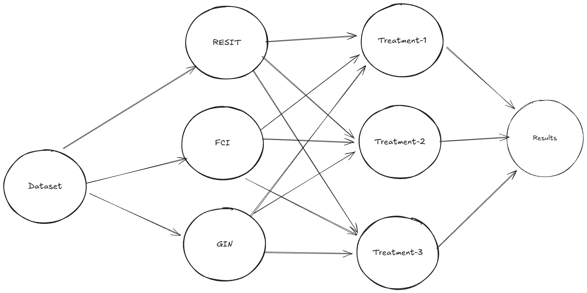
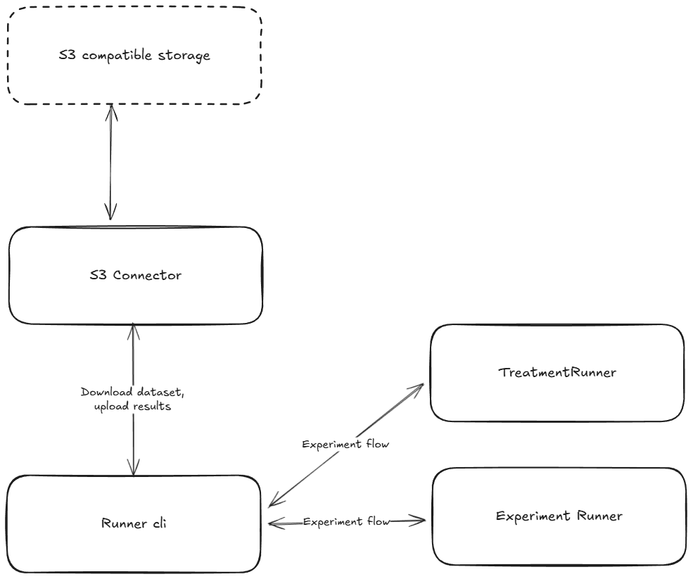
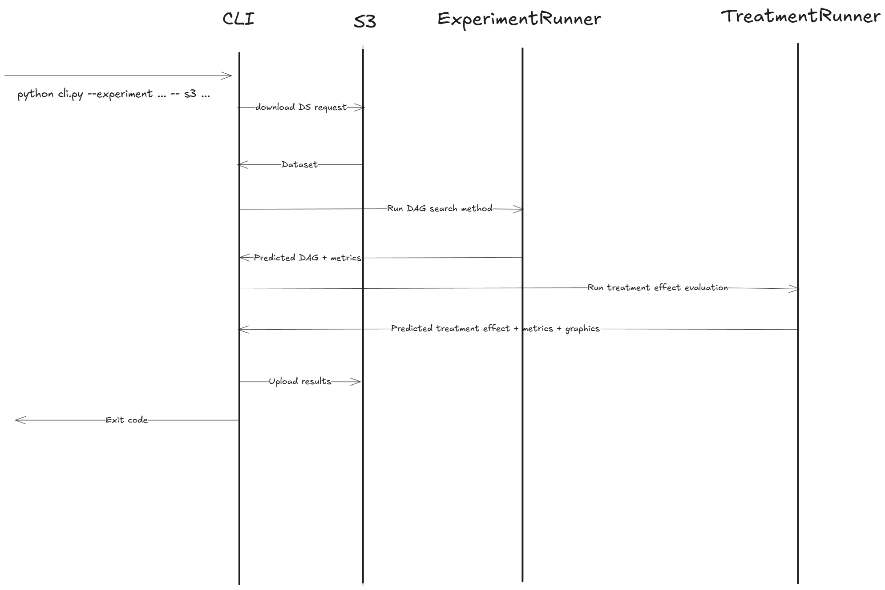
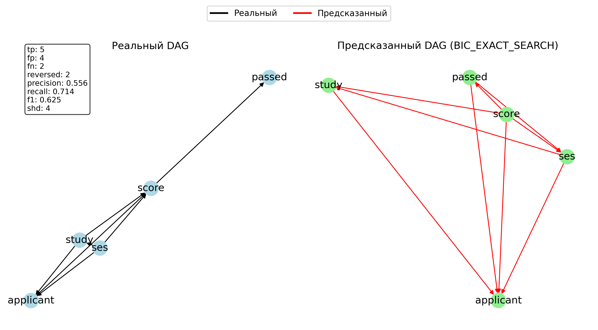
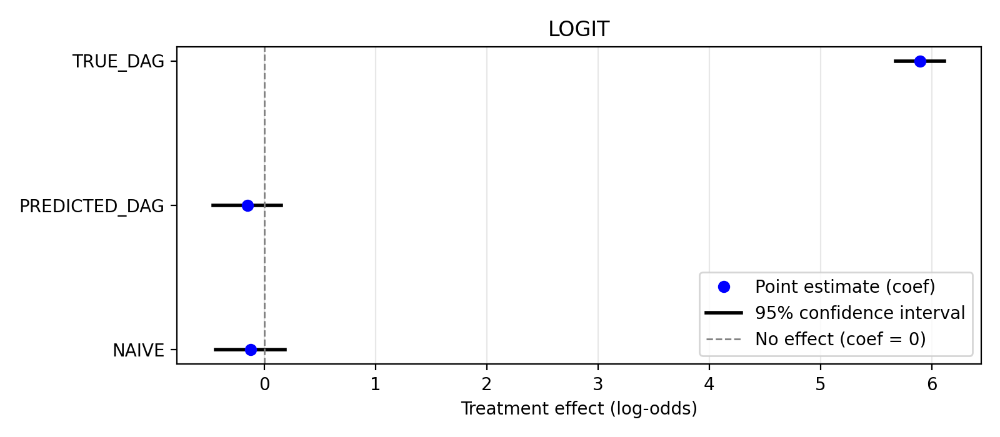
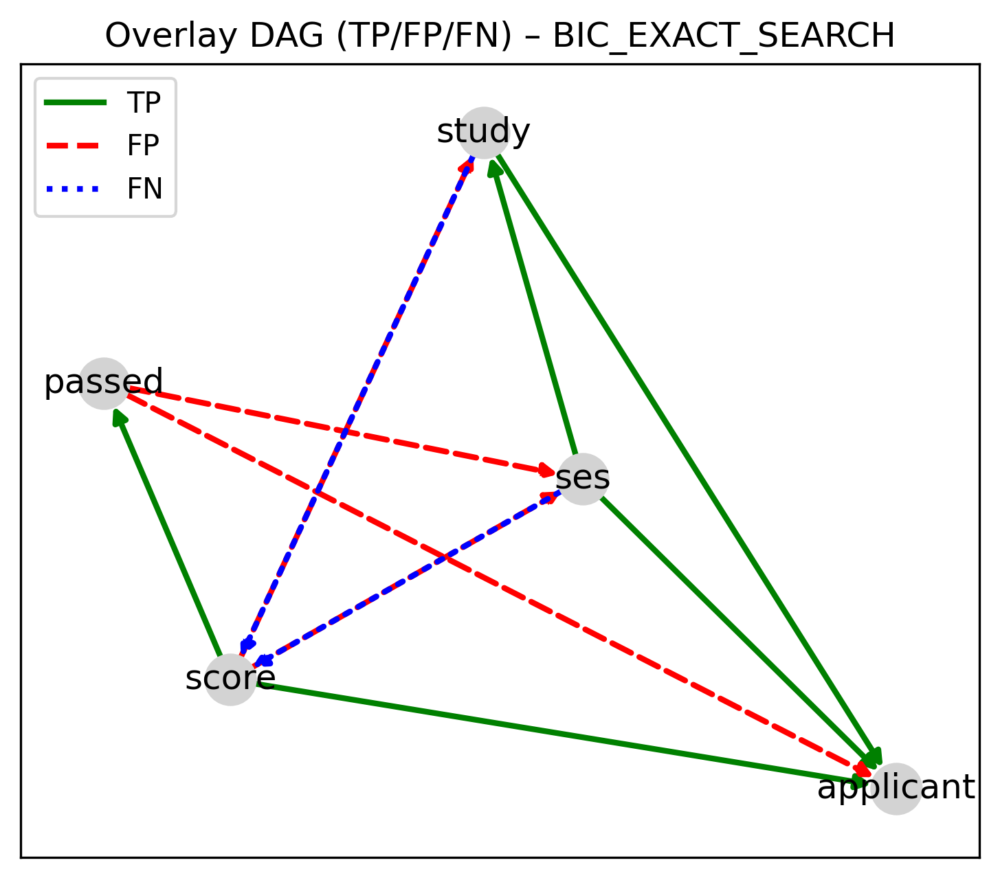

# DAGPipe - causal discovery pipelines framework

---
## Purpose

DAGPipe provides an ability to build and run scalable causal discovery pipelines


With DAGPipe you can concurrently run batch of experiments and boost causal discovery experience

---
## Architecture


DAGPipe include 3 services:

-  Runner - base calculations component wrapped in Docker container 
-  Orchestrator - accepts experiment pipeline, split it to "Runner" tasks and manage its execution
-  ExperimentEngine - entrypoint for running experiments

## Architecture\[Runner\]


Basically runner is cli tool, that accept experiment data and run pipeline. But wrapped in docker, it could be used
to run high-load experiments in parallel using orchestration for runtime management. Runner working flow below:



Practically, runner focused on running single search method with multiple treatment effect outcomes. But theoretically,
you can pass any "Experiment" on format described below

## Architecture[Orchestrator]

Orchestrator workflow based on idea of splitting one huge experiment to a batch os small ones, then every shorter experiment starts on separated "Runner" container.
Orchestrator control containers and send callback after all "Runner" instances done their job

---

## Experiment format
Experiment should be passed to Experiment engine as JSON.
Example:
```python
experiment = {
  "name": "Experiment-1",
  "results_path": "exp-1/results/",
  "ds_path": "exp-1/data/data.csv",
  "methods": [
    {
      "name": "RESIT",
      "params": {
        "alpha": 0.1,
        "regressor": "RandomForestRegressor",
        "regressor__max_depth": 4,
        "regressor__n_estimators": 50
      },
      "timeout":  300,
    },
    ...
  ],
  "causal_search": [
    {
      "treatment": [
        {
          "name": "X1",
          "type": "NUMERICAL"
        }
      ],
      "outcome": {
        "name": "Y",
        "type": "CATEGORIAL",
      }
    }
  ]
}

engine = ExpermentEngine()
engine.connect(celery_app, s3_url)
engine.load_data("exp-1/data/data.csv", "dataset.csv")
engine.run(experiment)
```

Experiment fields description:

| Field           | type                 | description                                                                       | required |
|-----------------|----------------------|-----------------------------------------------------------------------------------|----------|
| `name`          | `str`                | Experiment name                                                                   | y        |
| `result_path`   | `str`                | Direcory for experiment results                                                   | y        |
| `ds_path`       | `str`                | Path to dataset                                                                   | y        |
| `methods`       | `list[Method]`       | List of DAG search methods                                                        | y        |
| `causal_search` | `list[CausalSearch]` | List of treatment effect definitions                                              | n        |
| `true_dag_path` | `str`                | Path to true DAG (Results will contain comparision with true DAG if passed)       | n        |
| `columns`       | `str`                | List of columns in DS that will be used in Experiment (all cols if not specified) | n        |

Method fields description:

| Field           | type                 | description                                                                       | required |
|-----------------|----------------------|-----------------------------------------------------------------------------------|----------|
| `name`          | `MethodName` (enum)  | Target method name                                                                | y        |
| `params`        | `json`               | Custom method params                                                              | n        |
| `timeout`       | `int`                | Calculations timeout                                                              | n        |


MethodName values:

| MethodName         |
|--------------------|
| `PC`               |  
| `FCI`              |  
| `GIN`              |  
| `RESIT`            |  
| `BIC_EXACT_SEARCH` |  


CausalSearch fields description:

| Field       | type             | description                 | required |
|-------------|------------------|-----------------------------|----------|
| `treatment` | `list[Variable]` | List of treatment variables | y        |
| `outcome`   | `Variable`       | Outcome variable            | y        |

Variable fields description:

| Field  | type  | description                                     | required |
|--------|-------|-------------------------------------------------|----------|
| `name` | `str` | Variable name (should be in experiment columns) | y        |
| `type` | `str` | `NUMERICAL` \| `CATEGORICAL`                    | y        |


## Prepare & Run

The project is currently tested on Fedora-40 with python 3.12
Minimal requirements for running DAGPipe:
- Python > 3.11
- Poetry > 7.x
- 1GB RAM for every Runner instance + 1GB RAM for orchestrator
- External S3 compatible file storage (Currently tested with MinIO)
- Redis or RabbitMQ installation for celery queue
- Orchestrator machine must have socker access to docker or k8s host

You need set up at least this env variables for orchestrator

| Variable            | description                         | Default                        |
|---------------------|-------------------------------------|--------------------------------|
| `CELERY_BROKER_URL` | Celery broker url                   | `redis://localhost:6379/0`     |
| `CELERY_QUEUE`      | Celery queue for results exchanging | `engine.task`                  |
| `ORCH_BACKEND`      | Orchestration backend               | `docker`                       |
| `RUNNER_IMAGE`      | Built "Runner" image                |                                |
| `DOCKER_HOST_URL`   | Docker host url                     | `unix:///var/run/docker.sock"` |
| `K8S_NAMESPACE`     | Target k8s namespace                | `default`                      |


## Results structure

Result of running experiment is directory with collected metrics and graphics for every DAG search method
Directory structure:
```
/experiment_name
    /MethodName-1
        true_dag.csv
        dag.png
        dag_overlay.png
        metrics.csv
        predicted_dag.csv
    /MethodName-2
        ...
    /effect
        /treatment1_treatment2_2_outcome
            /MethodName-1
                dag_roles_predicted.png
                dag_roles_true.png
                effect_comparison.png
                summary.csv
            /MethodName-2
                ...
        /tratment3_treatment4_2_outcome2
            ...
```

## Examples of experiment results






Treatment effect metrics csv example

| method           | mode          | estimand | treatment | outcome | adjustment_set | coef                 | ci_low              | ci_high             | r2                 | model |
|------------------|---------------|----------|-----------|---------|----------------|----------------------|---------------------|---------------------|--------------------|-------|
| BIC_EXACT_SEARCH | NAIVE         | LOGIT    | study     | passed  |                | -0.12329539963682737 | -0.4338001617561109 | 0.18720936248245615 | 0.3256096881751185 | LOGIT |
| BIC_EXACT_SEARCH | PREDICTED_DAG | LOGIT    | study     | passed  | score          | -0.14993011434454898 | -0.4557231582233071 | 0.1558629295342092  | 0.3254644672131567 | LOGIT |
| BIC_EXACT_SEARCH | TRUE_DAG      | LOGIT    | study     | passed  | ses            | 5.89851639587262     | 5.679229955252334   | 6.117802836492905   | 0.1849896446696564 | LOGIT |

Other example results could be found in `/results/`